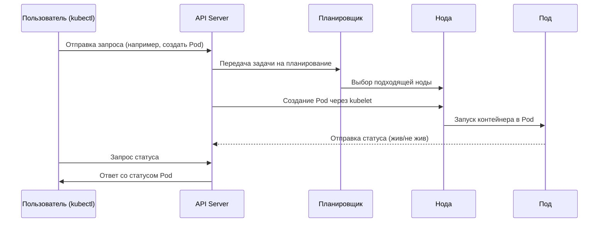

# Kubernetes

**Kubernetes — что это такое?**

Kubernetes (часто сокращённо — *K8s*) — это платформа с открытым исходным кодом для автоматизации развертывания, масштабирования и управления контейнеризированными приложениями. Изначально разработанный Google, Kubernetes сейчас поддерживается и развивается сообществом под эгидой Cloud Native Computing Foundation (CNCF).

**Зачем нужен Kubernetes?**

Когда приложение состоит не из одного сервиса, а из множества микросервисов, каждый из которых запускается в своём контейнере (например, Docker), их управление становится сложным: нужно отслеживать запуски, ошибки, обновления, масштабирование и балансировку нагрузки. Kubernetes решает эти задачи:

- Автоматически разворачивает контейнеры на кластере серверов (нод).
- Следит за состоянием приложений и перезапускает контейнеры в случае сбоев.
- Управляет сетевыми настройками и обеспечивает балансировку нагрузки.
- Позволяет обновлять приложения без остановки всей системы (rolling updates).
- Поддерживает масштабирование приложений в зависимости от нагрузки.

**Основные концепции Kubernetes:**

- **Pod** — минимальная единица развертывания в Kubernetes. Обычно один Pod содержит один контейнер, но может включать и несколько тесно связанных контейнеров.
- **Node** — физический или виртуальный сервер в кластере, на котором запускаются Pods.
- **Cluster** — группа узлов (Nodes), объединённых в единую систему под управлением Kubernetes.
- **Deployment** — объект, который описывает желаемое состояние приложения (например, сколько реплик Pods должно быть запущено) и позволяет Kubernetes поддерживать это состояние.
- **Service** — абстракция, обеспечивающая сетевой доступ к группе Pods.

**Почему Kubernetes популярен?**

- Позволяет запускать приложения одинаково на локальных серверах, в облаке и в гибридных инфраструктурах.
- Обеспечивает отказоустойчивость и автолечение приложений.
- Широкая экосистема плагинов, расширений и совместимость с большинством облачных провайдеров.

---

Конечно! Вот схема-карта основных компонентов Kubernetes в формате **Mermaid** (sequence диаграмма):

---

Эта схема описывает типичное взаимодействие:

- Пользователь с помощью `kubectl` отправляет команду.
- API-сервер принимает команду и координирует её выполнение.
- Планировщик выбирает, на какой ноде развернуть Pod.
- Нода через агент `kubelet` запускает контейнер.
- Pod отчитывается обратно в кластер о своём состоянии.

Хочешь, я ещё дополню схему, добавив, например, **Service**, **ReplicaSet** или **etcd** (хранилище состояния кластера)?  
Могу сделать чуть более подробную карту!
