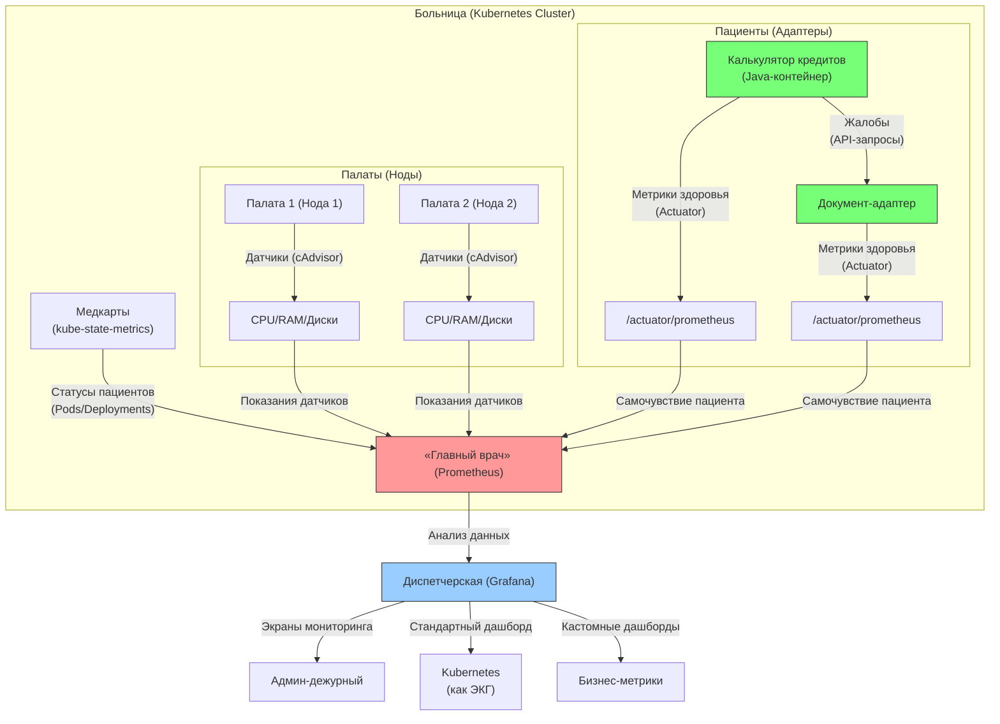

# Кластер K8s на примере развернутых в нём Java приложений.

## **Внутренняя структура конвейера Java развернутого в кластере K8s:**:

- **У вас язык бэкенда** - это Java и у вас в Кубере развернуты адаптеры (30 штук - это джарники (jar) взаимодействующие между собой по методу API), развернуты на двух нодах (нода - это мастер-кластер (группа серверов) с подами внутри, а вторая нода 1:1 такая же - это резервирование первой).
- **Адаптеры** (сленг банка, а по сути джарник в контейнере) - это микросервисы вашего одного большого конвейера (написанного на Java).
- **Адаптеры были разные**: бизнесовые, калькулятор для кредита, документы и прочие отдающие API (вы не обязаны помнить все адаптеры).
- **Как работали с адаптерами**? Дергали за ручки API (делали API запрос) изнутри контейнера пода, если зависал клиент по базе данных PostgreSQL (не может пройти калькуляцию кредита - это отдельный адаптер калькулятора. Либо не может получить документы подписанные банком на кредит (скачать) - тоже отдельный адаптер - документ-адаптер. Что значит зависал клиент? Это значит, что клиент начал оформлять кредит и завис на этапе калькуляции на сайте ввода кредита (калькулятор-адаптер) - и дальше у него не кликается. Или клиент завис на скачивании документа который уже банк подписал чтобы ему кредит выдать (документ-адаптер).
- **Развернут кредитный конвейер** (большое Java приложение - смотреть выше) был в Kubernetes и по сути на один адаптер приходилось по 2-3 пода (под - это минимальная абстракция K8S над контейнером(-ми) внутри пода).
-**Мониторинг Кубера** был реализован с помощью cAdvisor (это агент который отдает метрики, а Prometheus их забирает) и kube-state-metrics.
- **kube-state-metrics** - это метрики состояния объектов K8s (Pods, Deployments, Nodes).
- **Далее соответственно доставка метрик в Grafana** на стандартный дашборд под названием Kubernetes.
- **Дашборд Kubernetes** скачивается в виде `JSON` с официального сайта Grafana Labs и выводится.

### **Схема со Spring Actuator (в стиле "больничной" аналогии для простоты восприятия кластера K8s)**  



### **Пояснение ролей с Actuator**  

#### **(4) Spring Actuator — «Журнал самочувствия пациента»**  
**Что делает:**  
- Каждый Java-адаптер ведёт **собственный журнал здоровья**:  
  ```bash
  /actuator/prometheus   # Метрики работы API (сколько запросов, ошибок)
  /actuator/health       # Статус подключений к БД и другим сервисам
  ```
- Пример метрик:  
  ```promql
  http_server_requests_seconds_count{uri="/api/calculate"}  # Сколько раз вызывали калькулятор
  jdbc_connections_active{datasource="postgres"}           # Активные подключения к БД
  ```

**Как Prometheus его использует:**  
1. **Находит адаптеры** через Service Discovery (ищет поды с аннотацией `prometheus.io/scrape=true`).  
2. **Читает журнал** каждые 15 секунд (как врач обходит палаты).  
3. **Фиксирует проблемы**:  
   - Если `http_server_errors_total` растёт → API адаптера сбоит.  
   - Если `jdbc_connections_active` упало до 0 → нет связи с PostgreSQL.  

---

### **Как это помогает при проблемах?**  
#### **Сценарий: «Клиент завис на калькуляции кредита»**  
1. **Админ смотрит в Grafana**:  
   - **cAdvisor**: CPU адаптера-калькулятора > 90% → перегрузка.  
   - **Actuator**: `http_server_requests_seconds_max{uri="/calculate"}` показывает 10 сек (норма: 200 мс).  
   - **kube-state-metrics**: Под в статусе `Running`, но рестартов > 5 за час.  
2. **Вывод**: Калькулятор тормозит из-за медленных запросов к БД.  

#### **Сценарий: «Документы не скачиваются»**  
1. **Actuator показывает**:  
   - `disk_free_bytes` ≈ 0 → закончилось место.  
   - `tomcat_sessions_rejected_total` > 0 → адаптер не справляется с нагрузкой.  
2. **Решение**: Добавить поды или почистить хранилище.  

---

### **Дополнения?**  
1. **Prometheus не «принимает данные», а активно ходит за ними (натравлен на них)** (как врач с обходом).  
2. **Actuator добавлен как критический источник метрик** для бизнес-логики.  
3. **Цветовая маркировка**:  
   - Зелёные блоки — адаптеры (пациенты).  
   - Красный блок — Prometheus (главврач).  
   - Синий блок — Grafana (диспетчерская).  

Схема отражает **полный цикл мониторинга** кредитного конвейера.
