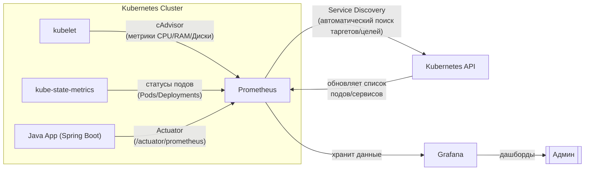

# Ваша легенда по стеку Java / Kubernetes

_По вашему стеку Java еще я дополню вопросы на курсе (сейчас слёг со спиной)!_

Зарисуйте самостоятельно эту схему в Figma (и вы сразу поймёте всю картину и для начала вдохновитесь графической схемой Кубера в Google, найдите попроще и всё станет понятно) и воспроизведите в DeepSeek - по сути это финал курса. - Но на собеседовании это спросят точно по вопросу о том как вы взаимодействовали с Java и с Kubernetes?

## **Внутренняя структура банка:** отвечаем на два вопроса на собесе разом:
### Про опыт с 1. Java и с 2. Kubernetes, советую заучить и приступать уже сегодня (Антон спросил, а не рано нам писать в стеке: Java? - нет, Антон, не рано:)), по сути это ваш стек Java+K8S для ответов на собеседовании: 

- **У вас язык бэкенда** - это Java и у вас в Кубере развернуты адаптеры (30 штук - это джарники (jar) взаимодействующие между собой по методу API), развернуты на двух нодах (нода - это мастер-кластер (группа серверов) с подами внутри, а вторая нода 1:1 такая же - это резервирование первой).
- **Адаптеры** (сленг банка, а по сути джарник в контейнере) - это микросервисы вашего одного большого конвейера (написанного на Java).
- **Адаптеры были разные**: бизнесовые, калькулятор для кредита, документы и прочие отдающие API (вы не обязаны помнить все адаптеры).
- **Как работали с адаптерами**? Дергали за ручки API (делали API запрос) изнутри контейнера пода, если зависал клиент по базе данных PostgreSQL (не может пройти калькуляцию кредита - это отдельный адаптер калькулятора. Либо не может получить документы подписанные банком на кредит (скачать) - тоже отдельный адаптер - документ-адаптер. Что значит зависал клиент? Это значит, что клиент начал оформлять кредит и завис на этапе калькуляции на сайте ввода кредита (калькулятор-адаптер) - и дальше у него не кликается. Или клиент завис на скачивании документа который уже банк подписал чтобы ему кредит выдать (документ-адаптер).
- **Развернут кредитный конвейер** (большое Java приложение - смотреть выше) был в Kubernetes и по сути на один адаптер приходилось по 2-3 пода (под - это минимальная абстракция K8S над контейнером(-ми) внутри пода).
-**Мониторинг Кубера** был реализован с помощью cAdvisor (это агент который отдает метрики, а Prometheus их забирает) и kube-state-metrics.
- **kube-state-metrics** - это метрики состояния объектов K8s (Pods, Deployments, Nodes).
- **Далее соответственно доставка метрик в Grafana** на стандартный дашборд под названием Kubernetes.
- **Дашборд Kubernetes** скачивается в виде `JSON` с официального сайта Grafana Labs и выводится.

## Как работает K8S мониторинг (cAdvisor) и как мониторится Java конвейер (Actuator)?

### **Полная схема мониторинга



### 🔍 [Как работает Service Discovery](https://github.com/lamjob1993/linux-monitoring/blob/main/prometheus/beginning/8.%20%D0%A1%D0%B5%D1%80%D0%B2%D0%B8%D1%81-%D0%B4%D0%B8%D1%81%D0%BA%D0%B0%D0%B2%D0%B5%D1%80%D0%B8%20(Service%20Discovery).md):
1. **Prometheus спрашивает у Kubernetes API**:
   - _"Какие поды/сервисы/ноды у тебя есть?"_
   - Использует роли:
     - `role: pod` (для Java Actuator)
     - `role: service` (для kube-state-metrics)
     - `role: node` (для cAdvisor)

2. **Фильтрация через аннотации** (пример для Java Actuator):
   ```yaml
   # В Deployment пода Java-приложения:
   annotations:
     prometheus.io/scrape: "true"    # <- "Собирай мои метрики!"
     prometheus.io/port: "8080"      # Порт Actuator
     prometheus.io/path: "/actuator/prometheus"
   ```

3. **Prometheus обновляет таргеты/цели** каждые 30 сек (по умолчанию).

### 🛠️ Что куда подключается:
| Компонент            | Как обнаруживается                          | Пример метрик                     |
|----------------------|--------------------------------------------|-----------------------------------|
| **cAdvisor**         | Автообнаружение нод (`role: node`)         | `container_cpu_usage_seconds`     |
| **kube-state-metrics** | Сервис с фиксированным именем (`role: service`) | `kube_pod_status_phase`       |
| **Java Actuator**    | Поды с аннотацией `prometheus.io/scrape`   | `http_server_requests_seconds`    |

### ⚙️ Конфиг Prometheus (фрагмент):
```yaml
scrape_configs:
  # Для Java Actuator
  - job_name: 'java-apps'
    kubernetes_sd_configs:
      - role: pod  # Ищем поды
    relabel_configs:
      - source_labels: [__meta_kubernetes_pod_annotation_prometheus_io_scrape]
        action: keep
        regex: "true"  # Берём только поды с аннотацией

  # Для cAdvisor
  - job_name: 'cadvisor'
    kubernetes_sd_configs:
      - role: node  # Ищем ноды
```

### 🔄 Круговорот данных:
1. **Kubernetes API** сообщает Prometheus: _"Вот список всех подов/сервисов/нод"_.
2. **Prometheus** фильтрует таргеты/цели по аннотациям и ролям.
3. **cAdvisor/kube-state-metrics/Actuator** отдают метрики.
4. **Grafana** берёт данные (Data Source) из Prometheus и рисует графики.

Теперь админ видит **всё**:
- Нагрузку на контейнеры (cAdvisor) → _"Java-приложение жрёт 90% CPU!"_ / похожая роль на экспортере Node Exporter
- Статусы подов (kube-state-metrics) → _"Под calculator-adapter в статусе CrashLoopBackOff!"_ / роль экспортера, который мониторит только состояние подов, перезапуск и т.д
- Бизнес-метрики (Actuator) → _"API /orders обрабатывает 1000 RPS!"_ / роль экспортера, который отдает метрики с Java-адаптеров
