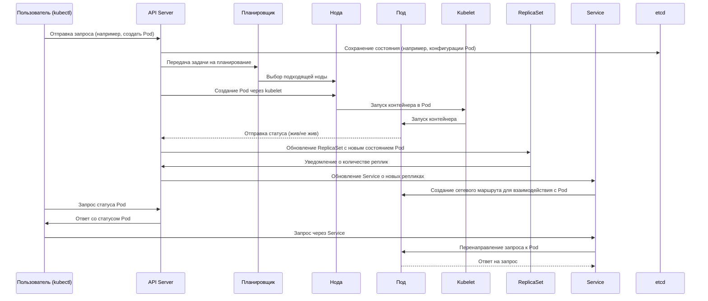

# Kubernetes

_Для начала [читаем эту статью](https://ru.wikipedia.org/wiki/Kubernetes). А потом возвращаемся сюда и продолжаем. Эта статья тяжелая для понимания, но топология Kubernetes очень простая, не сложнее модели OSI с соответствующими сетевыми протоколами._

**Kubernetes — что это такое?**

Kubernetes (часто сокращённо — *K8s*) — это платформа с открытым исходным кодом для автоматизации развертывания, масштабирования и управления контейнеризированными приложениями. Изначально разработанный Google, Kubernetes сейчас поддерживается и развивается сообществом под эгидой Cloud Native Computing Foundation (CNCF).

**Зачем нужен Kubernetes?**

Когда приложение состоит не из одного сервиса, а из множества микросервисов, каждый из которых запускается в своём контейнере (например, Docker), их управление становится сложным: нужно отслеживать запуски, ошибки, обновления, масштабирование и балансировку нагрузки. Kubernetes решает эти задачи:

- Автоматически разворачивает контейнеры на кластере серверов (нод).
- Следит за состоянием приложений и перезапускает контейнеры в случае сбоев.
- Управляет сетевыми настройками и обеспечивает балансировку нагрузки.
- Позволяет обновлять приложения без остановки всей системы (rolling updates).
- Поддерживает масштабирование приложений в зависимости от нагрузки.

**Основные концепции Kubernetes:**

- **[Pod](https://kubernetes.io/docs/concepts/workloads/pods/)** — минимальная единица развертывания в Kubernetes. Обычно один Pod содержит один контейнер, но может включать и несколько тесно связанных контейнеров.
- **[Node](https://kubernetes.io/docs/concepts/architecture/nodes/)** — физический или виртуальный сервер в кластере, на котором запускаются Pods.
- **[Cluster](https://kubernetes.io/docs/concepts/architecture/)** — группа узлов (Nodes), объединённых в единую систему под управлением Kubernetes.
- **Deployment** — объект, который описывает желаемое состояние приложения (например, сколько реплик Pods должно быть запущено) и позволяет Kubernetes поддерживать это состояние.
- **Service** — абстракция, обеспечивающая сетевой доступ к группе Pods.

**Почему Kubernetes популярен?**

- Позволяет запускать приложения одинаково на локальных серверах, в облаке и в гибридных инфраструктурах.
- Обеспечивает отказоустойчивость и автолечение приложений.
- Широкая экосистема плагинов, расширений и совместимость с большинством облачных провайдеров.

---

**Жизненный цикл приложения в Kubernetes: Взаимодействие компонентов**

В этой схеме показано взаимодействие основных компонентов Kubernetes при обработке запроса пользователя. Пользователь отправляет команду через **kubectl**, который взаимодействует с **API Server**, сохраняющим конфигурацию в **etcd**. Затем **Scheduler** планирует размещение Pod на ноде, а **Kubelet** запускает контейнеры в Pod. **ReplicaSet** следит за количеством реплик, а **Service** организует доступ к Pods, балансируя трафик между ними. Всё это позволяет эффективно управлять развертыванием, масштабированием и доступом к контейнеризированным приложениям.

---

### Описание компонентов:

- **User (kubectl)**: Пользователь взаимодействует с кластером через командную строку.
- **API Server**: Центральная точка взаимодействия с Kubernetes, которая координирует все запросы и действия.
- **Scheduler**: Определяет, на какую ноду нужно развернуть Pod.
- **Node**: Физический или виртуальный сервер, на котором работают Pods.
- **Pod**: Контейнеризированное приложение или сервис, работающий в Kubernetes.
- **Kubelet**: Агент, управляющий жизненным циклом Pod на каждой ноде.
- **ReplicaSet**: Обеспечивает поддержание заданного количества реплик Pods.
- **Service**: Позволяет организовать доступ к Pods, управляя маршрутизацией трафика.
- **Etcd**: Хранилище состояния кластера, в котором сохраняется вся конфигурация и метаданные.

Эта схема даёт полное представление о взаимодействии компонентов Kubernetes, включая управление состоянием приложений, репликацию, балансировку нагрузки и сетевое взаимодействие.
