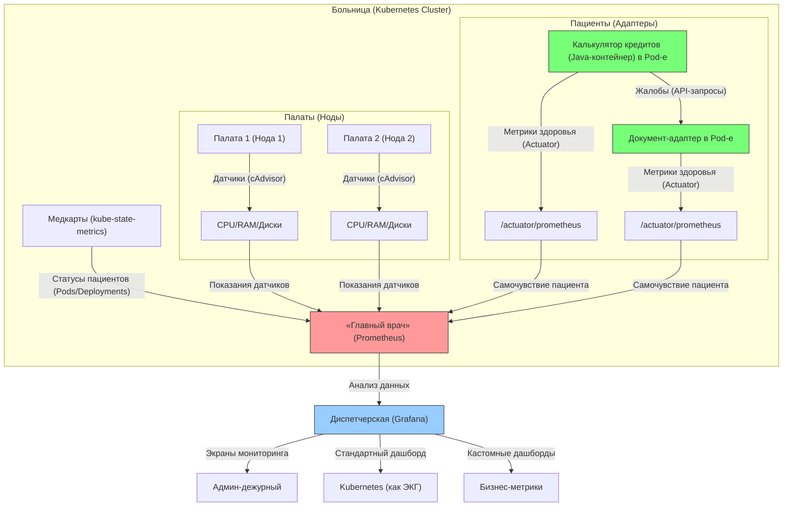

# **Схема в стиле "больничной" аналогии для простоты восприятия кластера K8s**  



## **Пояснение ролей**  

- _На схеме указано 2 адаптера (Калькулятор кредитов и Документ-адаптер) для удобства восприятия, на реальном ПРОД контуре их будет 30+._
- _А также Пациенты (Адаптеры) - это адаптеры входящие в состав подов, а поды находятся в нодах - это небольшое допущение схемы, но зато схема читается чище и понятнее._ 

### **Как всё устроено в Kubernetes мониторинге (простыми словами)**  

Представьте, что ваш Kubernetes-кластер — это **больница**, а мониторинг — это система наблюдения за пациентами (подами) и оборудованием (нодами).  

### **1. Кто за что отвечает?**  

#### **(1) cAdvisor — «Датчики на пациентах»**  
- **Что делает:**  
  - Замеряет **пульс (CPU), давление (RAM), температуру (Disk I/O)** у каждого контейнера.  
  - Встроен в **kubelet** (как встроенные датчики в больничной койке).  

- **Где смотреть метрики:**  
  - Открыть `https://<нода>:10250/metrics/cadvisor` (но нужны права).  
  - Пример метрик:  
    ```bash
    container_cpu_usage_seconds_total{container="nginx"}  # Сколько CPU съел контейнер
    container_memory_usage_bytes{pod="frontend-123"}      # Сколько RAM заняло
    ```

#### **(2) kube-state-metrics — «Медкарты пациентов»**  
- **Что делает:**  
  - Следит, **кто в коме (CrashLoopBackOff), кто выписан (Completed), кто только поступил (Pending)**.  
  - Не меряет пульс, а фиксирует **состояние** подов, деплойментов и нод.  

- **Где смотреть метрики:**  
  - Обычно работает в поде на порту `8080`.  
  - Пример метрик:  
    ```bash
    kube_pod_status_phase{phase="Running"}  # Сколько подов в работе
    kube_deployment_replicas_unavailable   # Сколько реплик упало
    ```

#### **(3) Spring Actuator — «Журнал самочувствия пациента»**  
**Что делает:**  
- Каждый Java-адаптер ведёт **собственный журнал здоровья**:  
  ```bash
  /actuator/prometheus   # Метрики работы API (сколько запросов, ошибок)
  /actuator/health       # Статус подключений к БД и другим сервисам
  ```
- Пример метрик:  
  ```promql
  http_server_requests_seconds_count{uri="/api/calculate"}  # Сколько раз вызывали калькулятор
  jdbc_connections_active{datasource="postgres"}           # Активные подключения к БД
  ```
**Как Prometheus его использует:**  
1. **Находит адаптеры** через Service Discovery (ищет поды с аннотацией `prometheus.io/scrape=true`).  
2. **Читает журнал** каждые 15 секунд (как врач обходит палаты).  
3. **Фиксирует проблемы**:  
   - Если `http_server_errors_total` растёт → API адаптера сбоит.  
   - Если `jdbc_connections_active` упало до 0 → нет связи с PostgreSQL.  

#### **(4) Prometheus — «Главный врач, который собирает все данные»**  
- **Что делает:**  
  - Ходит по палатам (нодам), **спрашивает у cAdvisor** (как себя чувствуют контейнеры).  
  - Читает **медкарты** из kube-state-metrics (кто жив, кто мёртв).  
  - **Автоматически находит новые поды** (Service Discovery).  

- **Как настраивается:**  
  - В `prometheus.yml` пишутся правила:  
    ```yaml
    scrape_configs:
      - job_name: 'cadvisor'          # Сбор метрик контейнеров
        kubernetes_sd_configs:         # Автообнаружение
          - role: node
      - job_name: 'kube-state-metrics' # Сбор состояния подов
        kubernetes_sd_configs:
          - role: service
    ```

#### **(5) Grafana — «Монитор в приёмном отделении»**  

- **Что делает:**  
  - Берёт данные от Prometheus и рисует **красивые графики**.  
  - Примеры дашбордов:  
    - **«Тяжелые пациенты»** — поды с высокой нагрузкой CPU.  
    - **«Кто в реанимации»** — поды в статусе `CrashLoopBackOff`.  

---

### **Как это помогает при проблемах?**  
#### **Сценарий: «Клиент завис на калькуляции кредита»**  
1. **Админ смотрит в Grafana**:  
   - **cAdvisor**: CPU адаптера-калькулятора > 90% → перегрузка.  
   - **Actuator**: `http_server_requests_seconds_max{uri="/calculate"}` показывает 10 сек (норма: 200 мс).  
   - **kube-state-metrics**: Под в статусе `Running`, но рестартов > 5 за час.  
2. **Вывод**: Калькулятор тормозит из-за медленных запросов к БД.  

#### **Сценарий: «Документы не скачиваются»**  
1. **Actuator показывает**:  
   - `disk_free_bytes` ≈ 0 → закончилось место.  
   - `tomcat_sessions_rejected_total` > 0 → адаптер не справляется с нагрузкой.  
2. **Решение**: Добавить поды или почистить хранилище.  

---

### **Дополнения:**  
1. **Prometheus не «принимает данные», а активно ходит за ними (натравлен на них)** (как врач с обходом).  
2. **Actuator добавлен как критический источник метрик** для бизнес-логики.  
3. **Цветовая маркировка**:  
   - Зелёные блоки — адаптеры (пациенты).  
   - Красный блок — Prometheus (главврач).  
   - Синий блок — Grafana (диспетчерская).  

Схема отражает **полный цикл мониторинга** кредитного конвейера.
