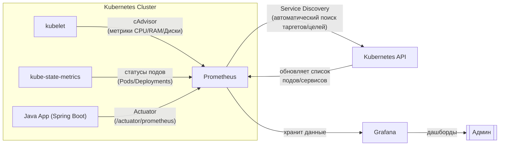

# Как работает K8s мониторинг (cAdvisor) и как мониторится Java конвейер (Actuator)?

## **Полная схема мониторинга**

Здесь **Kubernetes API**, как абстракция (сущность) взаимодействия между **Prometheus** и самим кластером **Kubernetes**. С помощью механизма Prometheus **(Service Discovery)** Прометеус получает данные о состоянии кластера K8s, обращаясь к **Kubernetes API**, в свою очередь **Kubernetes API** используется, как коллектор с метриками для **Prometheus**. Всё довольно просто.



### 🔍 [Как работает Service Discovery:](https://github.com/lamjob1993/linux-monitoring/blob/main/prometheus/beginning/8.%20%D0%A1%D0%B5%D1%80%D0%B2%D0%B8%D1%81-%D0%B4%D0%B8%D1%81%D0%BA%D0%B0%D0%B2%D0%B5%D1%80%D0%B8%20(Service%20Discovery).md)
1. **Prometheus спрашивает у Kubernetes API**:
   - _"Какие поды/сервисы/ноды у тебя есть?"_
   - Использует роли:
     - `role: pod` (для Java Actuator)
     - `role: service` (для kube-state-metrics)
     - `role: node` (для cAdvisor)

2. **Фильтрация через аннотации** (пример для Java Actuator):
   ```yaml
   # В Deployment пода Java-приложения:
   annotations:
     prometheus.io/scrape: "true"    # <- "Собирай мои метрики!"
     prometheus.io/port: "8080"      # Порт Actuator
     prometheus.io/path: "/actuator/prometheus"
   ```

3. **Prometheus обновляет таргеты/цели** каждые 30 сек (по умолчанию).

### 🛠️ Что куда подключается:
| Компонент            | Как обнаруживается                          | Пример метрик                     |
|----------------------|--------------------------------------------|-----------------------------------|
| **cAdvisor**         | Автообнаружение нод (`role: node`)         | `container_cpu_usage_seconds`     |
| **kube-state-metrics** | Сервис с фиксированным именем (`role: service`) | `kube_pod_status_phase`       |
| **Java Actuator**    | Поды с аннотацией `prometheus.io/scrape`   | `http_server_requests_seconds`    |

### ⚙️ Конфиг Prometheus (фрагмент):
```yaml
scrape_configs:
  # Для Java Actuator
  - job_name: 'java-apps'
    kubernetes_sd_configs:
      - role: pod  # Ищем поды
    relabel_configs:
      - source_labels: [__meta_kubernetes_pod_annotation_prometheus_io_scrape]
        action: keep
        regex: "true"  # Берём только поды с аннотацией

  # Для cAdvisor
  - job_name: 'cadvisor'
    kubernetes_sd_configs:
      - role: node  # Ищем ноды

  # Для kube-state-metrics
  - job_name: 'kube-state-metrics'
    kubernetes_sd_configs:
      - role: service
    relabel_configs:
      - source_labels: [__meta_kubernetes_service_name]
        action: keep
        regex: kube-state-metrics
```

### 🔄 Круговорот данных:
1. **Kubernetes API** сообщает Prometheus: _"Вот список всех подов/сервисов/нод"_.
2. **Prometheus** фильтрует таргеты/цели по аннотациям и ролям.
3. **cAdvisor/kube-state-metrics/Actuator** отдают метрики.
4. **Grafana** берёт данные (Data Source) из Prometheus и рисует графики.

Теперь админ видит **всё**:
- Нагрузку на контейнеры (cAdvisor) → _"Java-приложение жрёт 90% CPU!"_ / **похожая роль на экспортере Node Exporter**
- Статусы подов (kube-state-metrics) → _"Под calculator-adapter в статусе CrashLoopBackOff!"_ / **роль экспортера, который мониторит только состояние подов, перезапуск и т.д**
- Бизнес-метрики (Actuator) → _"API /orders обрабатывает 1000 RPS!"_ / **роль экспортера, который отдает метрики с Java-адаптеров**

Если что-то падает — сначала смотрите **логи подов**, потом **метрики cAdvisor**, потом **kube-state-metrics**. 🚑
